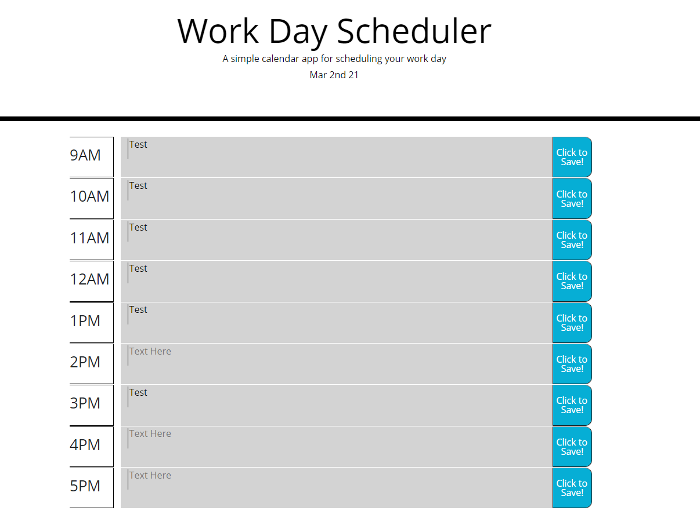
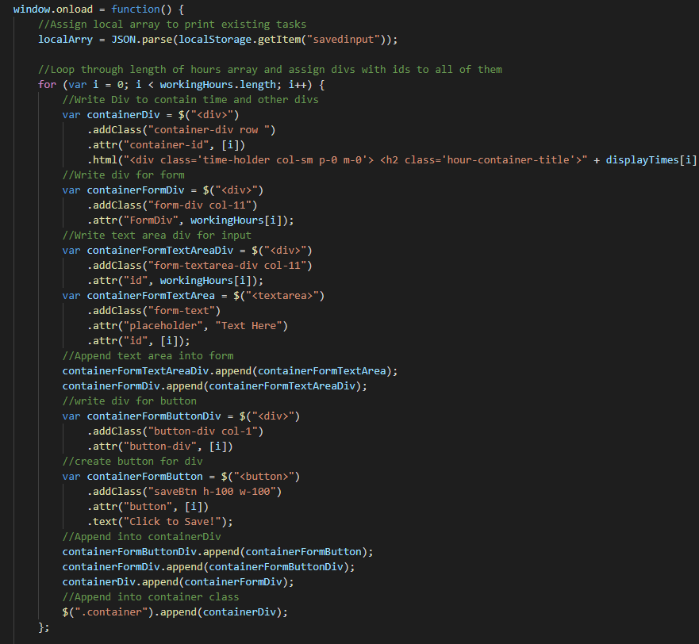
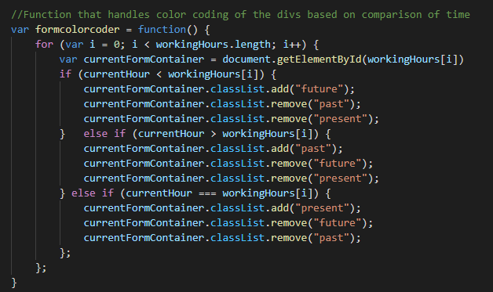

# Work Day Scheduler Starter Code

## Description
This weeks assignment was a lot easier than expected thanks to Jquery. I was able to streamline a lot of tasks with jQuery such as creating all my divs and seating different divs in them. Returning ids also was very easy using jQuery. I couldn't get ".each()" to work though so I just stuck with Javascripts for statement to build my loops. My first iteration of the code was with me writing all the divs into the html. I thought with jQuery though that I could streamline it and refactored it and let my js script loop through an array of all the possible times and write containers for them. Bootstrap also made it inredibly easy to style my containers with the way you can delegate column space. Next I built up a way of saving the input of the text area into localstorage. I used some jQuery methods to find the values and the ids of the text and insert them into an object that would later be put into the local storage. The biggest headache of all though was calling back the local storage and inserting them into the correct areas. I solved this by implementing another for loop that looped through the length of the localstorage aray. it would then take the id and the value of it and set the innerHtml of the corresponding id to the text document. For the color coding function I wrote a simple for statement that would add the classes and remove the classes every 30 minutes if the currentHour was less than greater than or equal to the id of the container for it.
## Installation
  Deployment url below! or if you would like to pull the code and see for yourself,
  git clone "https://github.com/aaronquach123/workdayscheduler.git"
## Usage
 1. Click deployment url
 2. Click on text field 
 3. Write whatever you want and press save button
## Deployment
https://aaronquach123.github.io/workdayscheduler/

## Screenshots

## Credits
A lot of looking at jQuerys website and Bootstrap to get the right parameters for all their stuff I was putting in!
